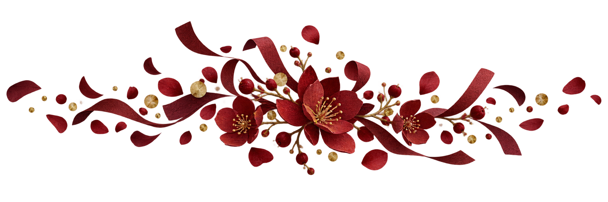
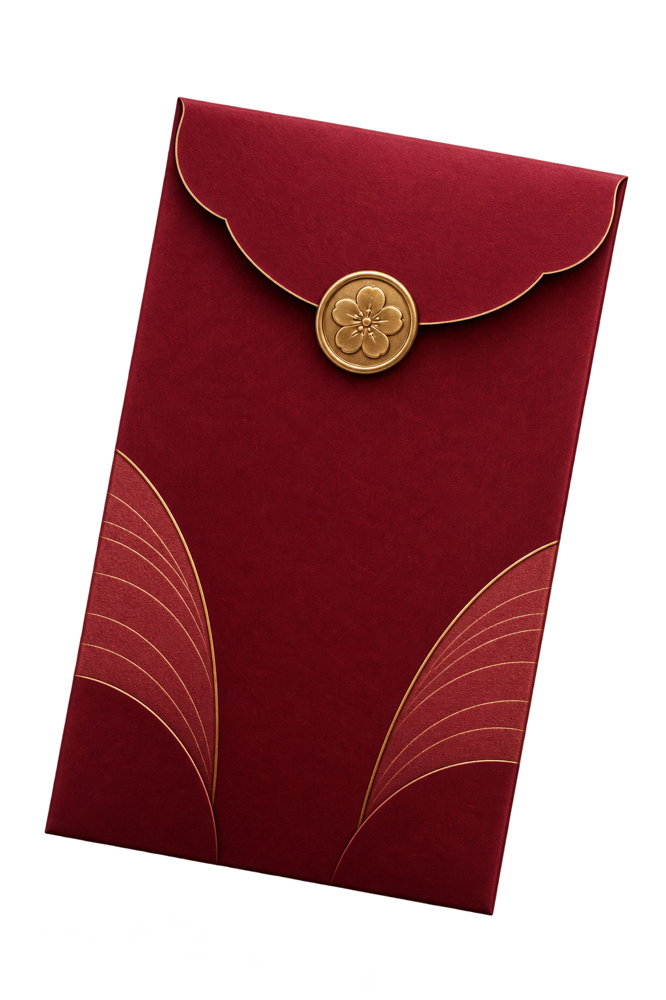
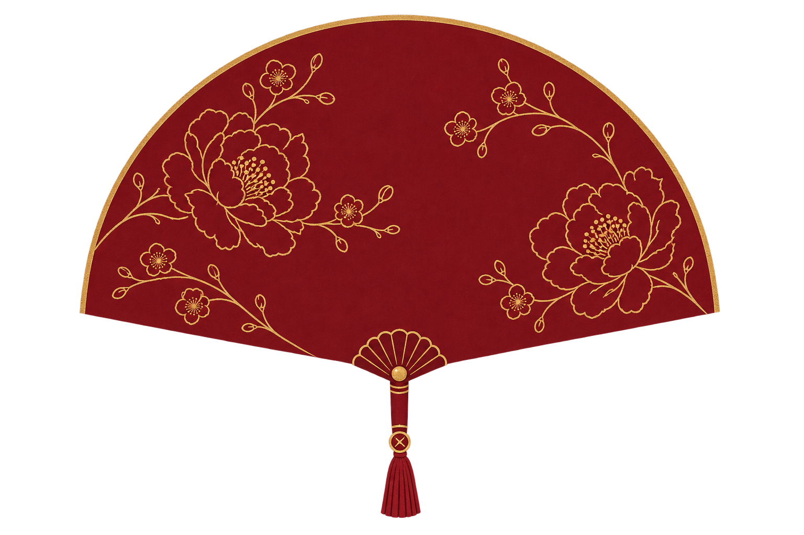

# Vạn Hỷ — Artwork preview sheet

Phase 2.5 candidate batch. These are renderer-owned decorative assets and are not uploadable invitation content.

## Opening floral pair

| Left cluster | Right cluster |
| --- | --- |
|  |  |

Files:

- `public/assets/images/templates/van-hy/decor/vh-opening-flower-left-v1.png`
- `public/assets/images/templates/van-hy/decor/vh-opening-flower-right-v1.png`

Intended use: opposing edge framing around the centered opening card. They should remain subordinate to the card surface and never sit over readable names or the open CTA.

## Celebration divider

File: `public/assets/images/templates/van-hy/decor/vh-celebration-divider-v1.png`

Intended use: optional section seam or event-burst accent. It carries no required information and can be hidden entirely for reduced motion or low-bandwidth fallback.

## Supporting Hỷ Sự decor

| Bao lì xì đỏ | Quạt giấy v4 | Chữ `囍` v4 |
| --- | --- | --- |
|  |  |  |

Files:

- `public/assets/images/templates/van-hy/decor/vh-lucky-envelope-v1.png`
- `public/assets/images/templates/van-hy/decor/vh-paper-fan-v4.png`
- `public/assets/images/templates/van-hy/decor/vh-double-happiness-v4.png`

The v4 fan has no surface ribs; its floral motif is dark antique-gold line art on a flat burgundy field, with no secondary flower colors. The v4 `囍` uses a natural torn-paper edge and tactile red paper texture, with no hard gold outline or metallic relief. Both are decorative only; any future semantic heading or editor-facing text must remain code-native to preserve exact glyphs and accessibility.

## Review checklist

- [ ] Alpha channel is clean at 320–480px render sizes; no visible rectangular matte or halo.
- [ ] Deep burgundy remains dominant against the current Vạn Hỷ shell.
- [ ] Left and right clusters feel related but are not mirror copies.
- [ ] The opening card and CTA remain the visual priority.
- [ ] Divider stays decorative and does not compete with Vietnamese headings.
- [ ] Reduced motion keeps artwork static without hiding required information.
- [ ] Owner approves candidates before renderer integration.

Hỷ characters and floating fragments remain code-native rather than rasterized so text accuracy and accessibility are preserved.
